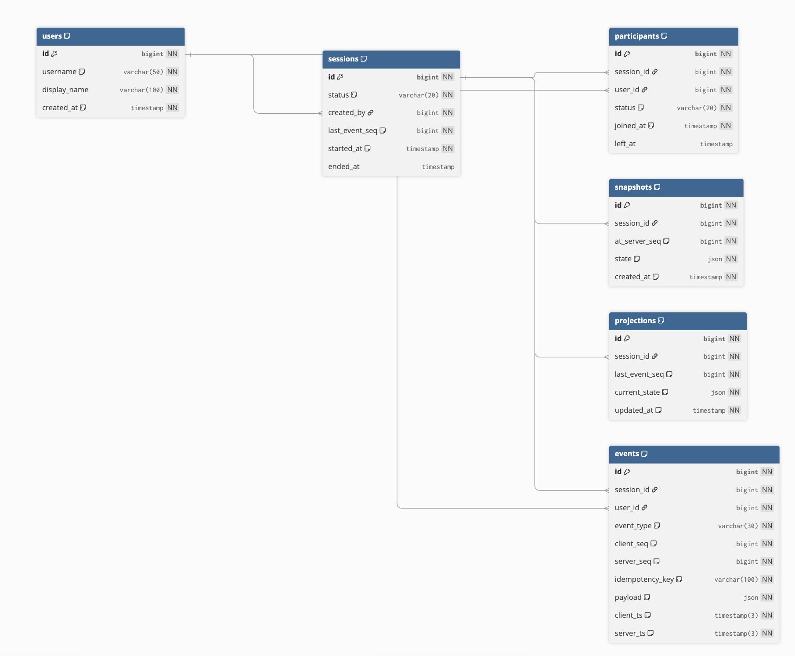

# chat-event-sourcing

> 1:1 실시간 채팅 + Event Sourcing 기반 상태 복원 시스템

---

## 목차

- [기술 스택](#기술-스택)
- [실행 방법](#실행-방법)
- [ERD](#erd)
- [API 명세서](#api-명세서)
- [설계 문서](#설계-문서)

---

## 기술 스택

| 분류 | 기술 |
|------|------|
| Language | Java 17 |
| Framework | Spring Boot 4.0.6 |
| 실시간 통신 | WebSocket (STOMP) |
| 메시지 브로커 | Redis Pub/Sub |
| Database | MySQL 8 |
| Cache / Presence | Redis |
| ORM | Spring Data JPA |
| Build | Gradle |

---

## 실행 방법

### 사전 요구사항

- Java 17
- Docker (MySQL, Redis 실행용)

### 환경 설정

```bash
# MySQL, Redis 실행
docker-compose up -d
```

### 애플리케이션 실행

```bash
./gradlew bootRun
```

### 접속

```
REST API : http://localhost:8080/api/v1
WebSocket: ws://localhost:8080/ws
```

---

## ERD

> 설계 도구: [dbdiagram.io](https://dbdiagram.io)

<!-- dbdiagram 캡처 이미지를 아래에 추가 -->


### 테이블 요약

| 테이블 | 역할 |
|--------|------|
| `users` | 사용자 기본 정보 |
| `sessions` | 1:1 채팅 세션 생명주기 관리 |
| `participants` | 세션 참여자 및 presence 상태 추적 |
| `events` | 모든 이벤트를 불변으로 저장하는 Event Store (핵심) |
| `snapshots` | 특정 시점 상태 스냅샷 (복원 최적화용) |
| `projections` | 현재 세션 상태 캐시 (세션당 1개) |

---

## API 명세서

### 공통 정보

| 항목 | 내용 |
|------|------|
| Base URL | `http://localhost:8080/api/v1` |
| Content-Type | `application/json` |
| 인증 | `Authorization: Bearer {token}` |

---

### 1. 세션 (Sessions)

| Method | Endpoint | 설명 | 요청 Body | 응답 코드 |
|--------|----------|------|-----------|-----------|
| POST | `/sessions` | 세션 생성 | `{ "participant_user_id": 2 }` | 201 / 400 / 404 / 409 |
| POST | `/sessions/{id}/join` | 세션 참여 | - | 200 / 404 / 409 / 410 |
| POST | `/sessions/{id}/end` | 세션 종료 | - | 200 / 403 / 404 / 409 |
| GET | `/sessions` | 세션 목록 조회 | - | 200 |

#### GET /sessions 쿼리 파라미터

| 파라미터 | 타입 | 필수 | 설명 |
|----------|------|------|------|
| `status` | String | N | `ACTIVE` / `ENDED` / `ABORTED` |
| `from` | ISO8601 | N | 시작 기간 필터 |
| `to` | ISO8601 | N | 종료 기간 필터 |
| `participant_user_id` | Long | N | 특정 참여자 포함 세션 |
| `page` | Integer | N | 페이지 번호 (기본 0) |
| `size` | Integer | N | 페이지 크기 (기본 20, 최대 100) |

---

### 2. 이벤트 (Events)

| Method | Endpoint | 설명 | 요청 Body | 응답 코드 |
|--------|----------|------|-----------|-----------|
| POST | `/sessions/{id}/events` | 이벤트 수집 | 아래 참고 | 201 / 400 / 403 / 404 / 410 |
| GET | `/sessions/{id}/events` | 이벤트 조회 | - | 200 / 404 |

#### POST /sessions/{id}/events 요청 Body

| 필드 | 타입 | 필수 | 설명 |
|------|------|------|------|
| `event_type` | String | Y | `MESSAGE` / `JOIN` / `LEAVE` / `DISCONNECT` / `RECONNECT` / `MESSAGE_EDITED` / `MESSAGE_DELETED` |
| `client_seq` | Long | Y | 클라이언트 부여 순서 번호 |
| `idempotency_key` | String | Y | 중복 방지 키 (클라이언트 생성) |
| `payload` | Object | Y | 이벤트 세부 내용 |
| `client_ts` | ISO8601 | Y | 클라이언트 발생 시각 |

#### GET /sessions/{id}/events 쿼리 파라미터

| 파라미터 | 타입 | 필수 | 설명 |
|----------|------|------|------|
| `from_seq` | Long | N | 이 seq 이후부터 조회 (재연결 resume) |
| `to_seq` | Long | N | 이 seq까지 조회 |
| `from` | ISO8601 | N | server_ts 기준 시작 |
| `to` | ISO8601 | N | server_ts 기준 종료 |
| `event_type` | String | N | 특정 타입 필터 |
| `limit` | Integer | N | 최대 반환 수 (기본 50, 최대 500) |

---

### 3. 상태 복원 (Timeline)

| Method | Endpoint | 설명 | 쿼리 파라미터 | 응답 코드 |
|--------|----------|------|--------------|-----------|
| GET | `/sessions/{id}/timeline` | 특정 시점 상태 복원 | `at` (ISO8601, 필수) | 200 / 400 / 404 |
| POST | `/sessions/{id}/snapshots` | 스냅샷 수동 생성 | - | 201 / 404 |

#### GET /sessions/{id}/timeline 복원 전략

```
가장 가까운 스냅샷 탐색
        ↓
[스냅샷 at seq=N] + [seq=N+1 ~ at 시점까지 이벤트 리플레이]
        ↓
해당 시점 세션 상태 반환 (참여자 목록 + 메시지 목록)
```

---

### 4. WebSocket (STOMP)

| 항목 | 내용 |
|------|------|
| 연결 엔드포인트 | `ws://localhost:8080/ws` |
| 프로토콜 | STOMP over WebSocket |

#### 클라이언트 → 서버 (발행 Destination)

| Destination | 설명 | 주요 필드 |
|-------------|------|-----------|
| `/app/sessions/{id}/send` | 메시지 전송 | `event_type`, `client_seq`, `idempotency_key`, `payload`, `client_ts` |
| `/app/sessions/{id}/join` | 세션 입장 | `client_seq`, `idempotency_key`, `client_ts` |
| `/app/sessions/{id}/leave` | 세션 퇴장 | `client_seq`, `idempotency_key`, `client_ts` |

#### 서버 → 클라이언트 (구독 Destination)

| Destination | 대상 | 설명 |
|-------------|------|------|
| `/topic/sessions/{id}` | 모든 참여자 | 세션 내 브로드캐스트 |
| `/user/queue/ack` | 발행자 본인 | 이벤트 처리 ACK |
| `/user/queue/errors` | 발행자 본인 | 에러 응답 |

---

### 5. 공통 에러 코드

| HTTP Status | Error Code | 설명 |
|-------------|------------|------|
| 400 | `INVALID_REQUEST` | 요청 파라미터 오류 |
| 403 | `FORBIDDEN` | 권한 없음 |
| 404 | `SESSION_NOT_FOUND` | 세션 없음 |
| 404 | `USER_NOT_FOUND` | 사용자 없음 |
| 409 | `DUPLICATE_SESSION` | 중복 세션 |
| 409 | `ALREADY_JOINED` | 이미 참여 중 |
| 410 | `SESSION_ENDED` | 종료된 세션 |
| 500 | `INTERNAL_ERROR` | 서버 내부 오류 |

---

## 설계 문서

- [DB 설계 및 인덱스 전략](docs/DATABASE.md)
- [이벤트 기반 상태 복원 전략](docs/EVENT_SOURCING.md)
- [재연결 및 중복 처리 전략](docs/RECONNECTION.md)
- [확장성 및 장애 대응](docs/SCALABILITY.md)
